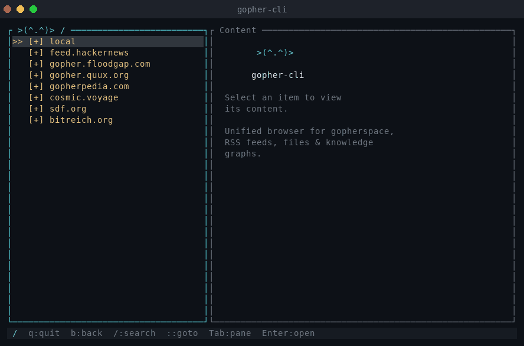

# gopher-cli

Structured content discovery for humans and agents. Browse local files,
RSS/Atom feeds, RDF knowledge graphs, and Gopher servers through a
single CLI and TUI — no server required.

```
       ┌───────┐     ┌───────┐     ┌────────┐     ┌───────┐
   ^   │ files │  ^  │ feeds │  ^  │ graphs │  ^  │  :70  │   ^
  /|\  └───┬───┘ /|\ └───┬───┘ /|\ └────┬───┘ /|\ └───┬───┘  /|\
  ~~~~~~~~~│~~~~~~~~~~~~~│~~~~~~~~~~~~~~│~~~~~~~~~~~~~~│~~~~~~~~~
  ░░░░░░░░░│░░░░░░░░░░░░░│░░░░░░░░░░░░░░│░░░░░░░░░░░░░░│░░░░░░░
  ░░░░┌────┘░░░░░░░┌─────┘░░░░░░░░┌─────┘░░░░░░░░┌─────┘░░░░░░░
  ░░░░│░░░░░░░░░░░░│░░░░░░░░░░░░░░│░░░░░░░░░░░░░░│░░░░░░░░░░░░░
  ░░░░└─────┐░░░░░░└──────┐░░░░░░░└──────┐░░░░░░░│░░░░░░░░░░░░░
  ░░░░░░░░░░└─────────────┴──────────────┴───────┘░░░░░░░░░░░░░
  ░░░░░░░░░░░░░░░░░░░░░░░░░│░░░░░░░░░░░░░░░░░░░░░░░░░░░░░░░░░░
  ░░░░░░░░░░░░░░░░░░░░░░░>(•.•)>░░░░░░░░░░░░░░░░░░░░░░░░░░░░░░░
  ░░░░░░░░░░░░░░░░░░░░░░░░░│░░░░░░░░░░░░░░░░░░░░░░░░░░░░░░░░░░░
  ░░░░░░░░░░░░░░░░░┌───────┴───────┐░░░░░░░░░░░░░░░░░░░░░░░░░░░
  ░░░░░░░░░░░░░░░░░│  ◊  V A U L T │░░░░░░░░░░░░░░░░░░░░░░░░░░░
  ░░░░░░░░░░░░░░░░░│  publish  ↓↑  │░░░░░░░░░░░░░░░░░░░░░░░░░░░
  ░░░░░░░░░░░░░░░░░│  delete   ×   │░░░░░░░░░░░░░░░░░░░░░░░░░░░
  ░░░░░░░░░░░░░░░░░│  browse   ☰   │░░░░░░░░░░░░░░░░░░░░░░░░░░░
  ░░░░░░░░░░░░░░░░░│  fetch    ◆   │░░░░░░░░░░░░░░░░░░░░░░░░░░░
  ░░░░░░░░░░░░░░░░░│  search   ⌕   │░░░░░░░░░░░░░░░░░░░░░░░░░░░
  ░░░░░░░░░░░░░░░░░└───────────────┘░░░░░░░░░░░░░░░░░░░░░░░░░░░
  ░░░░░░░░░░░░░░░░░░░░░░░░░░░░░░░░░░░░░░░░░░░░░░░░░░░░░░░░░░░░
```



## What It Does

All data sources are projected into a uniform menu/document hierarchy using
the Gopher content model. Paths follow the format `namespace/selector`
(e.g., `local/welcome`, `feed.hackernews/`, `vault/notes/idea.md`).

| Source | Example | How it works |
|--------|---------|-------------|
| **File System** | Agent vault, Jekyll `_posts/`, any directory tree | Directories become menus, text files become documents. Writable namespaces support publish/delete. |
| **RSS / Atom** | Hacker News, blog feeds | Feed entries become documents under a channel menu |
| **RDF / SPARQL** | Knowledge graphs, DBpedia, local Turtle files | Classes become menus, resources become documents, SPARQL backs search |
| **Gopher servers** | `gopher.floodgap.com` | Transparent TCP proxy to live Gopherspace |

## Quick Start

```bash
# Build
cargo build -p gopher-cli --release

# Browse all namespaces
gopher-cli browse

# Browse a namespace
gopher-cli browse local/

# Read a document
gopher-cli fetch local/welcome

# Launch the interactive TUI
gopher-cli
```

## Installation

### From source

```bash
git clone https://github.com/penserai/gopher-cli.git
cd gopher-cli
cargo install --path gopher-cli
```

### Cross-compilation

```bash
make build              # Release build for host (darwin-arm64)
make build-darwin-arm64 # aarch64-apple-darwin
make build-darwin-x86   # x86_64-apple-darwin
make build-linux-arm64  # aarch64-unknown-linux-gnu (requires cross)
make build-linux-x86    # x86_64-unknown-linux-gnu (requires cross)
make build-all          # All architectures
```

Darwin targets use native `cargo build`. Linux targets use [`cross`](https://github.com/cross-rs/cross) (Docker-based). Binaries output to `dist/`.

## CLI

The CLI is the primary interface for both humans and agents. It embeds the
full content engine — no server process needed.

### Commands

```
gopher-cli browse [path]                  List items at a path
gopher-cli fetch <path>                   Retrieve document content
gopher-cli search <path> <query>          Search within a namespace
gopher-cli publish <path> [--content ..]  Write a document
gopher-cli delete <path>                  Delete a document
gopher-cli dump <source> <dest>           Bulk-copy between namespaces
gopher-cli [tui]                          Launch interactive browser
```

### Output Format

Output is automatically JSON when stdout is piped (for scripts and agents).
On a TTY, output is human-friendly text. Force JSON anytime with `--json`.

```bash
# Human — sees formatted text
gopher-cli browse local/
# [T] Welcome to gopher-cli                    local/welcome
#       -----------------------
# [+] Submenu Example                          local/sub

# Agent — stdout piped, gets JSON automatically
result=$(gopher-cli browse local/)
echo "$result"
# [{"type":"0","type_name":"TextFile","display":"Welcome to gopher-cli", ...}, ...]
```

### Browse

List items at a path. With no path, lists all available namespaces.

```bash
gopher-cli browse                       # all namespaces
gopher-cli browse local/                # items in a namespace
gopher-cli browse local/sub             # subdirectory
gopher-cli browse gopher.floodgap.com/  # live Gopher server
```

### Fetch

Retrieve a document's text content.

```bash
gopher-cli fetch local/welcome
gopher-cli fetch feed.hackernews/entry/0
gopher-cli fetch gopher.floodgap.com/gopher/tech/
gopher-cli fetch feed.hackernews/entry/0 > article.txt  # save to file
```

### Search

Search within a namespace. Filters menu entries by query string; adapters
with native search (RDF/SPARQL) use their own engine.

```bash
gopher-cli search local/ "welcome"
gopher-cli search feed.hackernews/ "rust"
gopher-cli search gopherpedia.com/ "gopher protocol"
```

### Publish

Write or update a document. Reads content from `--content` or stdin. Only
works on writable namespaces (e.g., `vault`).

```bash
# Inline content
gopher-cli publish vault/notes/idea.md --content "# My Idea
This could work."

# From stdin
echo "Quick note" | gopher-cli publish vault/scratch.md

# Pipe from another command
gopher-cli fetch feed.hackernews/entry/0 | gopher-cli publish vault/saved/hn-top.md
```

### Delete

Delete a document or directory from a writable namespace.

```bash
gopher-cli delete vault/notes/idea.md
```

### Dump

Recursively copy documents from a source into a writable namespace. Walks
menus up to `--max-depth` levels (default: 3).

```bash
gopher-cli dump feed.hackernews/ vault/mirrors/hn
gopher-cli dump rdf.demo/ vault/mirrors/rdf --max-depth 2
gopher-cli dump gopher.floodgap.com/gopher/tech vault/mirrors/floodgap-tech
```

### Global Options

| Option | Env Var | Description |
|--------|---------|-------------|
| `--url <URL>` | `GOPHER_CLI_URL` | Connect to a remote server instead of the embedded engine |
| `--no-seed` | | Skip seeding example content into the `local` namespace |
| `--json` | | Force JSON output (auto-enabled when stdout is piped) |

### Connection Precedence

The CLI defaults to the embedded engine. To connect to a remote server:

1. `--url` flag (highest priority)
2. `GOPHER_CLI_URL` environment variable
3. `url` field in `~/.gopher-cli.toml`
4. Embedded engine (default — no server needed)

```bash
# One-off remote command
gopher-cli --url http://localhost:8443 browse

# Set for the whole session
export GOPHER_CLI_URL=http://localhost:8443
gopher-cli browse
```

### Exit Codes

| Code | Meaning |
|------|---------|
| `0` | Success |
| `1` | Error (details on stderr, structured JSON when piped) |

## TUI

The interactive terminal browser. Launches when no subcommand is given.

```bash
gopher-cli                  # start at root
gopher-cli tui               # explicit
gopher-cli tui local/        # start at a specific path
```

### Keybindings

| Key | Action |
|-----|--------|
| `j`/`k` or arrows | Navigate menu |
| `Enter` | Open item |
| `b` or `Backspace` | Go back |
| `Tab` | Switch pane (menu / content) |
| `Space` | Page down (content pane) |
| `PgUp`/`PgDn` | Scroll content |
| `/` | Search within current namespace |
| `:` | GoTo popup (jump to any namespace) |
| `Tab` (in GoTo) | Expand/collapse directory |
| `Home` | Go to root |
| `q` | Quit |

## Agent Usage

The CLI is built so AI agents can use Bash tool calls instead of MCP.
Auto-JSON output, structured errors, pipe-friendly publish, and composable
commands mean agents can work with gopher-cli using only the Bash tool.

### Discovery

```bash
# What namespaces are available?
gopher-cli browse

# What's in a namespace?
gopher-cli browse vault/

# Drill into a directory
gopher-cli browse vault/research/
```

### Read

```bash
# Get a document
gopher-cli fetch vault/research/topic.md

# Search then read the first result
gopher-cli search vault/ "machine learning"
gopher-cli fetch vault/research/ml-overview.md
```

### Write

```bash
# Save a note
gopher-cli publish vault/notes/idea.md --content "# Idea
Something interesting."

# Pipe content from another source
gopher-cli fetch feed.hackernews/entry/3 \
  | gopher-cli publish vault/saved/article.md
```

### Bulk Operations

```bash
# Copy all articles from a feed into the vault
gopher-cli dump feed.hackernews/ vault/mirrors/hn

# Verify what was copied
gopher-cli browse vault/mirrors/hn/
```

### JSON Output Reference

**Browse / Search** returns an array of items:

```json
[
  {
    "type": "1",
    "type_name": "Menu",
    "display": "Submenu Example",
    "path": "local/sub",
    "mime": "application/x-gopher-menu"
  }
]
```

**Fetch** returns path and content:

```json
{ "path": "local/welcome", "content": "Document text here..." }
```

**Publish / Delete** returns confirmation:

```json
{ "ok": true, "path": "vault/notes/idea.md", "action": "published" }
```

**Dump** returns counts:

```json
{ "ok": true, "source": "feed.hackernews/", "destination": "vault/mirrors/hn", "published": 15, "skipped": 2 }
```

**Errors** (on stderr):

```json
{ "error": "Fetch failed: Selector not found: /missing in local" }
```

### Item Types

| `type` | `type_name` | Meaning |
|--------|-------------|---------|
| `1` | Menu | Directory — pass to `browse` |
| `0` | TextFile | Document — pass to `fetch` |
| `7` | Search | Search endpoint — pass to `search` |
| `h` | Html | HTML document — pass to `fetch` |
| `i` | Info | Display-only text (no path) |

## Config

Place at `~/.gopher-cli.toml`. Used by both CLI commands and the TUI.

```toml
# Remote mode — uncomment to connect to a running gopher-cli-server.
# url = "http://127.0.0.1:8443"

# Gopherspace sources (shown in the TUI GoTo popup)
sources = [
    "gopher.floodgap.com/",
    "gopher.quux.org/",
    "cosmic.voyage/",
]

# RSS / Atom feed
[[adapter]]
type = "rss"
namespace = "feed.hackernews"
url = "https://hnrss.org/frontpage"

# File system directory (writable = agent vault)
[[adapter]]
type = "fs"
namespace = "vault"
root = "/path/to/vault"
writable = true

# File system directory (read-only)
[[adapter]]
type = "fs"
namespace = "docs"
root = "/path/to/notes"
extensions = ["md", "txt"]

# RDF knowledge graph
[[adapter]]
type = "rdf"
namespace = "rdf.dbpedia"
sparql_endpoint = "https://dbpedia.org/sparql"
format = "turtle"
```

### Adapter Types

| Type | Required fields | Optional fields |
|------|----------------|-----------------|
| `rss` | `namespace`, `url` | |
| `fs` | `namespace`, `root` | `extensions` (e.g., `["md", "txt"]`), `writable` (bool) |
| `rdf` | `namespace` | `source` (file or URL), `format`, `sparql_endpoint` |

Adapters sync their content into the embedded engine at startup. Adapter
namespaces are automatically added to the TUI GoTo popup.

## Server

For use cases that need a persistent HTTP endpoint (e.g., MCP integration
with AI tools that support JSON-RPC).

```bash
# Generate dev certificates
./scripts/gen-certs.sh

# Run with mTLS
cargo run -p gopher-cli-server

# Run without TLS (development)
cargo run -p gopher-cli-server -- --no-tls

# Run with adapters
cargo run -p gopher-cli-server -- --no-tls --config examples/rss-demo.toml
```

Point the CLI at the server:

```bash
gopher-cli --url http://127.0.0.1:8443 browse local/
```

The server exposes all six operations (browse, fetch, search, publish,
delete, dump) as MCP tools over JSON-RPC at `/mcp`, with optional mTLS
for mutual authentication.

## Architecture

Cargo workspace with three crates:

| Crate | Type | Description |
|-------|------|-------------|
| `gopher-cli-core` | Library | Content router, local store, Gopher client, MCP handler, source adapter trait |
| `gopher-cli` | Binary | CLI + TUI. Embeds the core engine. Self-contained single binary. |
| `gopher-cli-server` | Binary | axum HTTP server with mTLS. Use when you need a persistent server process. |

```
├── gopher-cli-core/           # library crate
│   └── src/
│       ├── lib.rs              # public re-exports
│       ├── router.rs           # content router (local store + Gopher proxy)
│       ├── store.rs            # in-memory content store (namespaces, menus, docs)
│       ├── gopher.rs           # Gopher client, ItemType, MenuItem
│       ├── mcp.rs              # MCP JSON-RPC handler and tool definitions
│       └── adapters/           # SourceAdapter trait + fs, rss, rdf adapters
├── gopher-cli/                # CLI + TUI binary
│   └── src/
│       ├── main.rs             # subcommands, embedded/remote startup
│       ├── cli.rs              # CLI command handlers, auto-JSON output
│       ├── client.rs           # ContentClient trait, McpClient, EmbeddedClient
│       ├── config.rs           # config file parsing, adapter creation
│       ├── app.rs              # TUI application state and logic
│       └── ui.rs               # ratatui rendering
└── gopher-cli-server/         # HTTP server binary
    └── src/
        ├── main.rs             # axum wiring, adapter sync, startup
        ├── config.rs           # server config parsing
        └── tls.rs              # mTLS certificate handling
```

### Content Model

Content is organized as **namespaces** containing **menus** (directories)
and **documents** (text files), mirroring the Gopher protocol's two
fundamental content types. The router parses `namespace/selector` paths
and either looks up local content or proxies to a real Gopher server
on port 70.

### Source Adapters

Adapters project external data into the local store:

```rust
#[async_trait]
pub trait SourceAdapter: Send + Sync {
    fn namespace(&self) -> &str;
    async fn sync(&self, store: &LocalStore) -> Result<(), AdapterError>;
    async fn search(&self, selector: &str, query: &str) -> Option<Vec<MenuItem>>;
}
```

| Adapter | Projection |
|---------|-----------|
| **RSS/Atom** | Feed channel → root menu, entries → documents, categories → submenus |
| **File System** | Directories → menus, text files → documents, `.gophermap` → custom menus |
| **RDF/SPARQL** | Classes → submenus, resources → documents, SPARQL endpoint → native search |

## License

Apache-2.0
